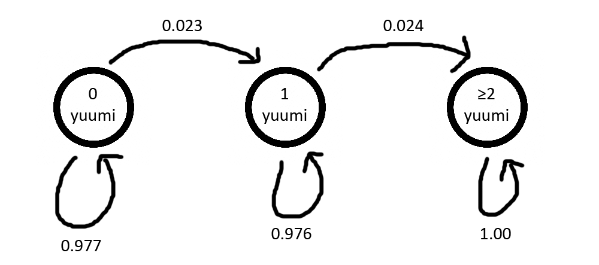

# TFT-Rolling-Odds-Calculator
A calculator that provides the odds of hitting your units in TFT, made with very simple HTML and Chart.js

Visit [here](https://wongkj12.github.io/TFT-Rolling-Odds-Calculator/).

### Brief explanation of the math
In TFT, a roll gives you 5 shops.
Each shop rolls for the cost of the unit first (based on your current level), followed by the unit itself (based on the number of units left & the pool size for units of that cost). So for example if we are rolling for Yuumi,

$$
P(\text{hit Yuumi in this shop}) = P(\text{roll 2-cost})\cdot\frac{\text{number of yuumis left}}{\text{number of 2-costs left}}
$$

Brute-force probability calculation is cumbersome as $\text{number of yuumis left}$, etc. may decrease as you roll. Thus, rolls can be modelled with Markov Chains.

Suppose we want to find the probability of finding x yuumis after exactly 2 shops. Below is an example of a Markov Chain given some number of yuumis and 2-costs out of the pool already:

We start with 0 yuumis (on the left), and after 2 shops we must be in one of the 3 states above. The arrows represent the transition probabilities, i.e. probability of going from one state to another. We can write the corresponding transition matrix:

$$
\begin{pmatrix}
0.977 & 0.023 & 0 \\
0 & 0.976 & 0.024 \\
0 & 0 & 1
\end{pmatrix}
$$

Since we roll twice, we square the transition matrix as follows:

$$
\begin{pmatrix}
0.977 & 0.023 & 0 \\
0 & 0.976 & 0.024 \\
0 & 0 & 1
\end{pmatrix}^2 = 
\begin{pmatrix}
0.955 & 0.045 & 0.0006 \\
0 & 0.952 & 0.047 \\
0 & 0 & 1
\end{pmatrix}
$$

Because of how matrix multiplication works, we can read off "P(start with i yuumis and end with j yuumis)" from the (i, j)-th entry of this matrix! Thus we have a 0.955 chance of getting no yuumis, a 0.045 chance of getting 1 yuumi, and a 0.0006 chance of getting 2 yuumis after seeing 2 shops.

For the purposes of this calculator, the transition matrix $M$ is 10 x 10 (To calculate probabilities of getting up to 9 yuumis), and we basically compute $M^{5g/2}$, where $g$ is the amount of gold spent (since 2 gold = 5 shops).
